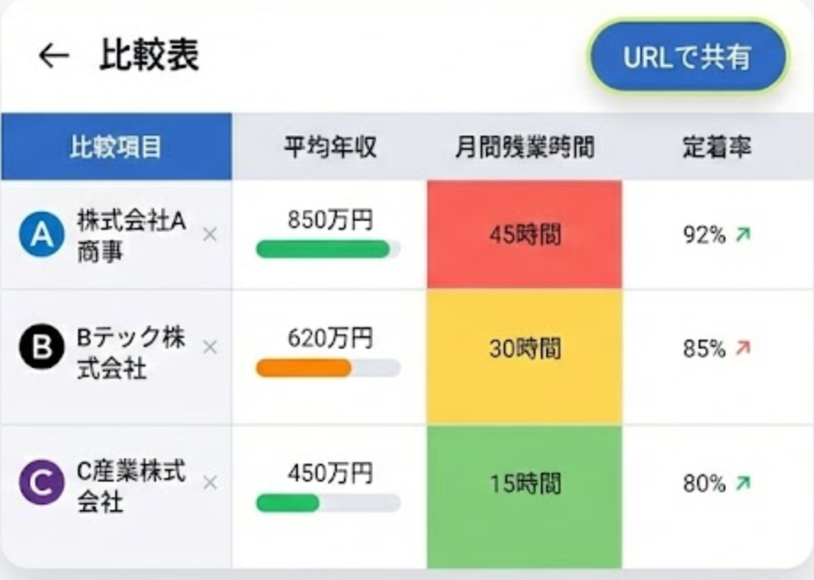

# 就活ファクトチェックアプリ (MVP) 仕様要件定義書

## 1. プロダクト概要

### コンセプト

> 「企業データを、**分かりやすく比較**できる就活アプリ」

### コア価値

- 企業の「見かけの給与」ではなく「**実質時給**」や「**労働環境**」を可視化
- 複数企業の情報を**直感的に比較**でき、意思決定を支援
- 将来的には**口コミ機能**も導入し、定量データと定性情報の両面から企業を評価

### ターゲットユーザー

安定志向、コストパフォーマンス重視の就活生

---

## 2. システムアーキテクチャ

**コストゼロ、サーバー管理不要、高速動作** を実現する **Jamstack構成** を採用する。

| レイヤー | 技術 | 説明 |
|----------|------|------|
| **Frontend** | Next.js (React) / TypeScript | SSG でビルド時にHTMLを生成。ブラウザ上で検索・ソート処理（サーバー通信なし） |
| **Backend (ETL)** | Python Script | ローカル環境で実行。APIからデータを収集・加工し、静的JSONファイルを生成 |
| **Infrastructure** | Vercel / Netlify | GitHub連携による自動デプロイ |
| **Database** | なし | `companies.json` をDB代わりに使用 |
| **Auth** | なし | 完全ログインレス |

---

## 3. ディレクトリ構成

```
comp2-web/
├── public/
├── docs/                      # 設計書などのドキュメント
├── app/                       # Next.js App Router
│   ├── _server-side/          # サーバーサイド処理
│   ├── _client-side/          # クライアントサイド処理
│   ├── (page)/                # ページ
│   ├── _shared/               # サーバー＆クライアント共通
│   └── _data/                 # 事前生成データ
│       └── companies.json     # ★ 生成されたデータファイル（DB代わり）
├── scripts/
│   └── generate_data.py       # ★ データ生成用Pythonスクリプト
├── package.json
└── README.md
```

---

## 4. データ要件 (Schema Design)

### 4.1 データソース

| ソース | 提供元 | 取得データ |
|--------|--------|------------|
| **EDINET API** | 金融庁 | 財務データ（年収、年齢、売上、利益、従業員数） |
| **女性の活躍推進企業DB API** | 厚労省 | 労働環境データ（残業時間、有休取得率） |
| **OpenAI API** | OpenAI (Optional) | 定性情報の要約、タグ付け |

### 4.2 JSONデータモデル (`companies.json`)

パフォーマンス最適化のため、**計算済み (Pre-calculated) の値**を持たせる。

```json
[
  {
    "id": "7203",                    // 証券コード
    "name": "トヨタ自動車",
    "kana": "トヨタジドウシャ",
    "industry": "輸送用機器",
    "metrics": {
      "salary": 895,                 // 平均年収 (万円)
      "age": 40.4,                   // 平均年齢 (歳)
      "duration": 16.4,              // 平均勤続年数 (年)
      "employees": 70710,            // 従業員数 (人)
      "revenue": 371542,             // 売上高 (億円)
      "profit_margin": 7.3,          // [計算済] 営業利益率 (%)
      "equity_ratio": 39.8,          // [計算済] 自己資本比率 (%)
      "overtime": 24.5,              // 月間残業 (時間) or null
      "paid_leave": 82.0,            // 有休消化率 (%) or null
      "hourly_wage": 3250            // [計算済] 実質時給 (円)
    },
    "content": {
      "summary": "AI生成による3行企業要約...",
      "risk_text": "財務から読み取れる懸念点...",
      "tags": ["グローバル", "製造業", "安定"]
    },
    "flags": {
      "is_holding": false            // HD判定フラグ (従業員数極小かつ高年収)
    }
  }
]
```

### 4.3 独自指標の計算ロジック

Python側（ETL）で事前計算する。

| 指標 | 計算式 |
|------|--------|
| **実質時給** | `平均年収 ÷ ((7.5h × 20日 × 12ヶ月) + (月間残業 × 12))` |
| **営業利益率** | `営業利益 ÷ 売上高 × 100` |

---

## 5. 機能要件 (Functional Specs)

### 5.A トップページ (Search & Discovery)


#### リアルタイム検索

- **Fuse.js** 等を使用し、社名・コード・タグ・業種での**あいまい検索**を行う

#### サジェスト表示

- 入力中に候補リストを表示
- 各候補には「**平均年収**」を併記する

#### 比較カート

- ユーザーが選択した企業を一時保存（**最大4社**）
- 2社以上選択で「**比較する**」ボタンを活性化

#### ランダム提案 (ガチャ)

- 検索ワードが空の場合、「**隠れ優良企業**（時給が高い・利益率が高い）」をランダム表示

---

### 5.B 比較画面 (Comparison Matrix)

#### 最大4社比較ビュー

- スマホ画面で**横スクロール可能**なテーブルUI
- **スティッキーヘッダー**: スクロールしても企業名・ロゴが上部に追従



#### ヒートマップ着色

4社の中で数値比較を行い、自動で背景色を変更する。

| 色 | 意味 | 対象指標 |
|----|------|----------|
| **緑系 (Good)** | 良い | 年収高、時給高、有休高、利益率高 |
| **赤系 (Bad)** | 悪い | 残業多、離職率高 |

#### SOM（自己組織化マップ）

データを元にSOMを表示する。

---

### 5.C ユーザーアクション (No Login)

#### ワンタップ投票

- 「激務そう」「成長できそう」「ホワイト」「給料が高い」等のボタン設置
- **LocalStorage制限**: ブラウザごとに重複投票を防止

#### 閲覧履歴

- 過去に比較した企業の組み合わせを**LocalStorage**に保存し、トップに表示

---

## 6. 技術スタック & ツール

| カテゴリ | 技術・ツール | 備考 |
|----------|--------------|------|
| **Frontend** | Next.js (App Router) | React framework |
| **Language** | TypeScript | 型安全性確保 |
| **Styling** | Tailwind CSS | ユーティリティクラス |
| **ETL Script** | Python 3.x | pandas, requests ライブラリ使用 |
| **Search Lib** | Fuse.js | クライアントサイド検索 |
| **Hosting** | Vercel | GitHub連携 |
| **Source Data** | EDINET API / 厚労省API | 公的データ |

---

## 7. 開発・運用フロー

### Step 1: データ更新 (Monthly)

```bash
# ローカルPCにて実行
python scripts/generate_data.py
```

→ 最新の `companies.json` を生成・上書き

### Step 2: デプロイ

```bash
git add .
git commit -m "Update company data"
git push origin main
```

→ Vercelが自動検知し、ビルド・デプロイを実行

### Step 3: ユーザー利用

最新データが反映された静的サイトを閲覧
